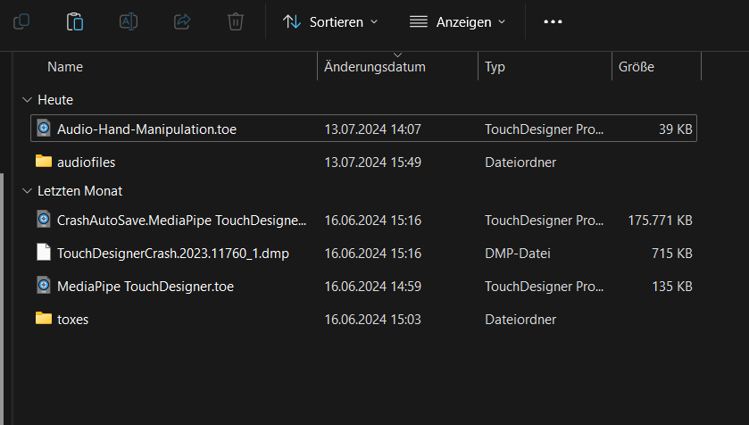
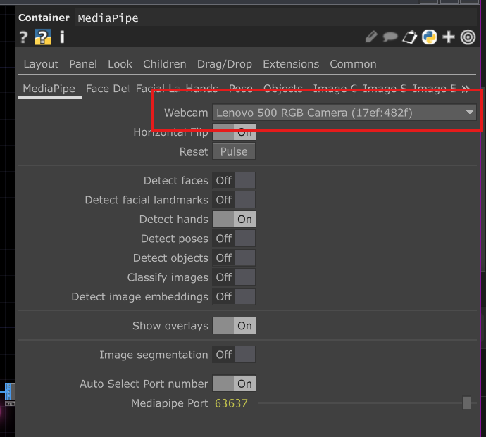
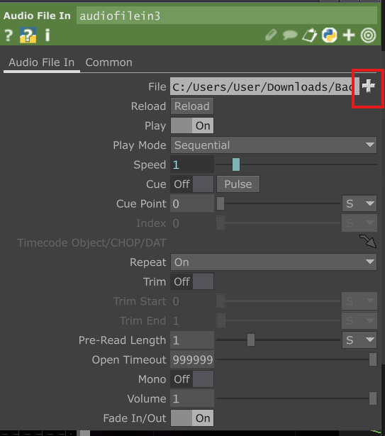

# P6_Endabgabe - Kim Karn

Der Proof of Concept für das Semesterprojekt ParkPhonie umfasst 3 Teile. 

## Teil 1: ParkPhonie Showcase

Hinter diesem Ordner verbirgt sich der Code für eine html Seite, über die man das Projekt selbst ausprobieren kann. Wenn man Personen auf Klangflächen zieht, werden verschiedene Klänge ausgelöst. Dadurch wird deutlich, dass jede einzelne Person den gesamten Klangraum beeinflusst. Die Abgabe des Codes dient als Dokumentation, die eigentliche Seite wird über ein privates Repo über Render gehostet.

Link zum ParkPhonie Showcase: https://parkphonie-showcase.onrender.com/

## Teil 2: Audio Manipulation
Dieser Ordner umfasst die Audio-Hand-Manipulation.toe sowie einige Audiodateien zum ausprobieren. Durch das Auf und Ab bewegen der ersten Hand wird die Stärke eines Low-Pass Filters gesteuert. Durch das Auf und Ab bewegen der zweiten Hand wird die Geschwindigkeit der Audiodatei beeinflusst. Die Hände symbolisieren Personen, die auf einer Klangfläche stehen und zwei verschiedene Modifikationen auführen. Durch Zusammenarbeit und Ausprobieren, erhalten sie ihre gewünschten Klangeffekte.

### Voraussetzungen für die Inbetriebnahme
- PC/Laptop
- Webcam
- TouchDesigner
- MediaPipe Plugin

### Installation
TouchDesigner ist über folgenden Link herunterladbar: https://derivative.ca/download

Zum Tracken der Positionen der Hände wurde das MediaPipe Plugin verwendet. Die aktuelle Version zum Download findet sich hier: https://github.com/torinmb/mediapipe-touchdesigner/releases.

1. TouchDesigner installieren.

1. MediaPipe Plugin release.zip herunterladen.

2. release.zip entpacken.

3. Die "Audio-Hand-Manipulation.toe" Datei und den Ordner "audiofiles" aus dem P6_Endabgabe Repo herunterladen und in den MediaPipe release Ordner einfügen. Der Ordnerinhalt sollte so aussehen: 

4. Die "Audio-Hand-Manipulation.toe" Datei öffnen.

5. Die Webcam sollte automatisch erkannt werden. Falls nicht, dann auf die MediaPipe Komponente ganz links klicken und dort die Webcam auswählen (siehe Bild).

6. Die AudioFiles können bei der Komponente audiofilesin ausgetauscht werden. Hierfür einfach auf das Plus drücken und Audios aus dem "audiofile" Ordner auswählen (natürlich können auch andere Audiodatein verwendet werden). 

## Teil 3: Show-Modus
In der Datei "Partikel-ShowModus.toe" wird ein Beispiel Klangraum durch eine audioreaktive Partikelwolke visualisiert. Das symbolisiert den Show-Modus von ParkPhonie. Um die Datei öffnen zu können, muss TouchDesigner installiert und die zwei Dateien aus dem Repo heruntergeladen worden sein.

_________

<b>Alles weitere zum Proof of Concept gibt es in der Dokumentation auf Moodle!</b>